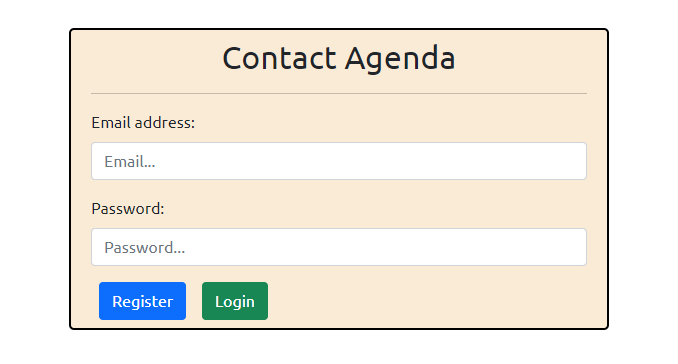
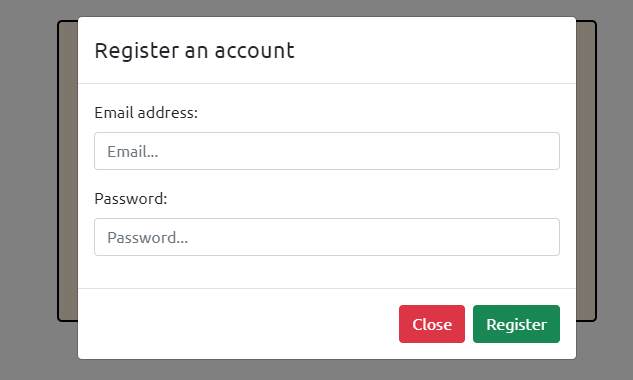
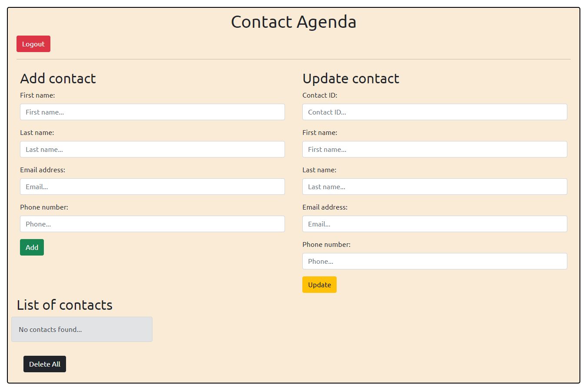
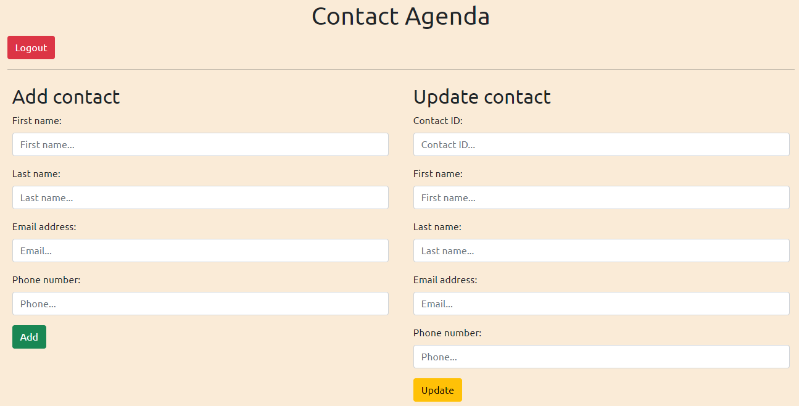
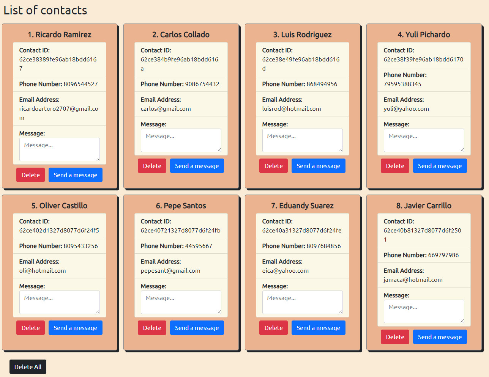
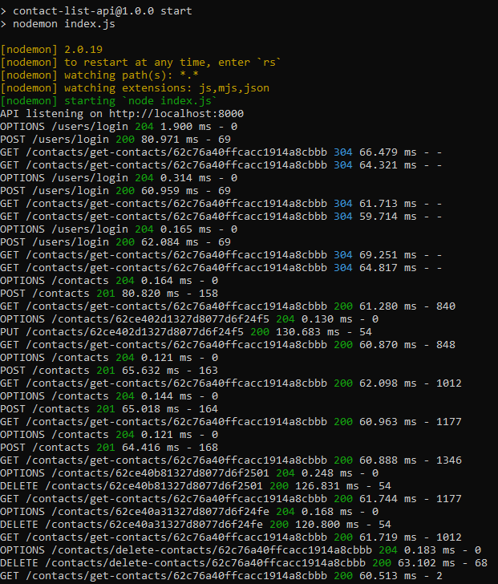

# Contact Agenda

This project consists of a system to manage a contact agenda which is able to do the basic CRUD functions by connecting to a MongoDB database.

## SPA

- React
- Axios
- Bootstrap
- React Bootstrap

## API

- Node
- Express
- MongoDB
- dotenv
- body-parser
- Morgan
- CORS

Nodemon is used as a dev dependency for hot-reload.

### Endpoints

#### Users

```js
_id: ObjectId;
email: String;
password: String;
```

**- Create an account**

`POST /users`

**- Do login**

`POST /users/login`

#### Contacts

```js
_id: ObjectId;
userId: ObjectId;
firstName: String;
lastName: String;
email: String;
phoneNumber: String;
```

**- Get all the contacts**

`GET /contacts`

**- Get a contact by it's id**

`GET /contacts/{id}`

**- Get all the contacts for a given user**

`GET /contacts/get-contacts/{userId}`

**- Create a contact**

`POST /contacts`

**- Update a contact**

`PUT /contacts/{id}`

**- Delete a contact**

`DELETE /contacts/{id}`

**- Delete all the contacts of an user**

`DELETE /contacts/delete-contacts/{userId}`

### Preview

#### Login




#### Agenda





#### API


